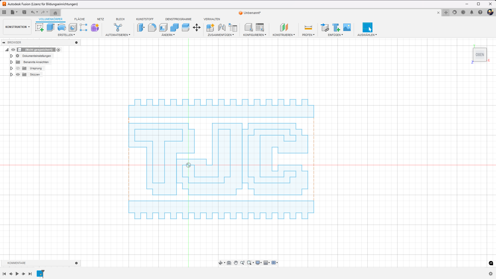

# TheJoCraft-Logo-Lamp
This is a 3D Printed Logo Lamp for the YouTuber TheJocraft(https://www.youtube.com/thejocraft)

## Session 1
I took the logo and copy to Fusion  
  
  
  
Picures how it made are in the V1 folder with the Files

## Session 2
I madefrom the logo the buttom of my box and create a fittig back.  
In the back are a hole for a port to plug in  
Upstairs is also a hole for the toggle.  

##  Print
Because it's difficult to print is out that light can go thru the logo you can use the TJC-Lamp - Final.3mf for BambuLab Slicer

